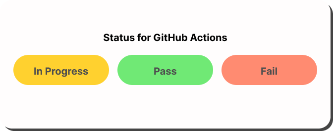

# 🎯 Status of GitHub Actions

See the status of GitHub Actions on your keyboard! 🎮

## 🔑 Key Features

* 🔄 **Real-time monitoring** of GitHub Actions per repository
* 🚀 **Multiple repositories** can be tracked by adding the applet multiple times
* 🎨 **Color-coded key** for easy status identification:
  * 🟢 **Green**: GitHub actions success
  * 🔴 **Red**: GitHub actions failed
  * 🟠 **Blinking orange**: GitHub actions running

## 🛠️ Installation

### 📋 Step 1: Create a GitHub Personal Access Token

1. Go to your [GitHub settings](https://github.com/settings/tokens) 🔗
2. On the left sidebar, click on "**Developer settings**" 👨‍💻
3. Click on "**Personal access tokens**" 🔑
4. Click on "**Tokens (classic)**" 📝
5. Click on "**Generate new token**" (classic) or "**New token**" (new UI) ➕
   * 💡 Give your token a descriptive name, such as "**Das Keyboard Q Applet**"
   * 🎯 Under "**Select scopes**", grant the token the "**repo**" permission. This permission provides read-only access to repository metadata, commits, and pull requests, which is sufficient for the applet to function
   * ✅ Click on "**Generate token**" (classic) or "**Create token**" (new UI) to create the token
   * 📋 Copy the generated token

### 📋 Step 2: Configure the Applet

⚙️ During the installation using the Q software, configure the applet with:

* 🔑 Your GitHub personal access token
* 👤 The repository owner's username
* 📁 The desired repository name

🎉 Once the applet is installed, it will track the GitHub Actions in the specified repository and update the LED color on your Das Keyboard Q!

## 🔒 Security

⚠️ **Important**: Always give the minimum permissions required when creating a personal access token to avoid security issues. In this case, the "**repo**" permission is sufficient for the applet to function properly.

## 📚 Source Code

## 👏 Credit

This applet was originally created by [SoulaymaneK](https://github.com/SoulaymaneK/daskeyboard-applet--action-status-for-github) 🙏
